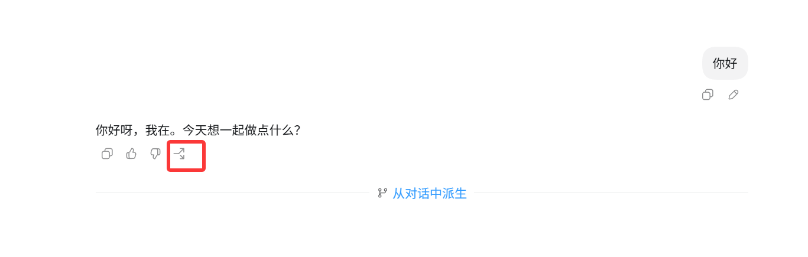
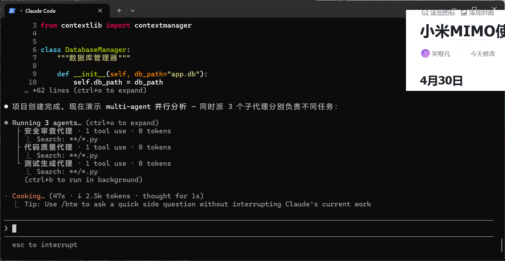
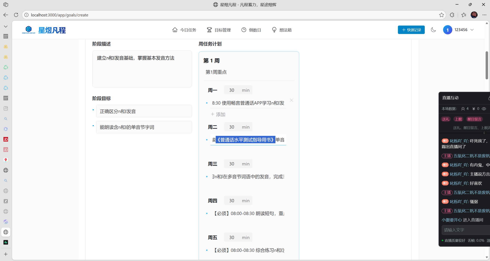
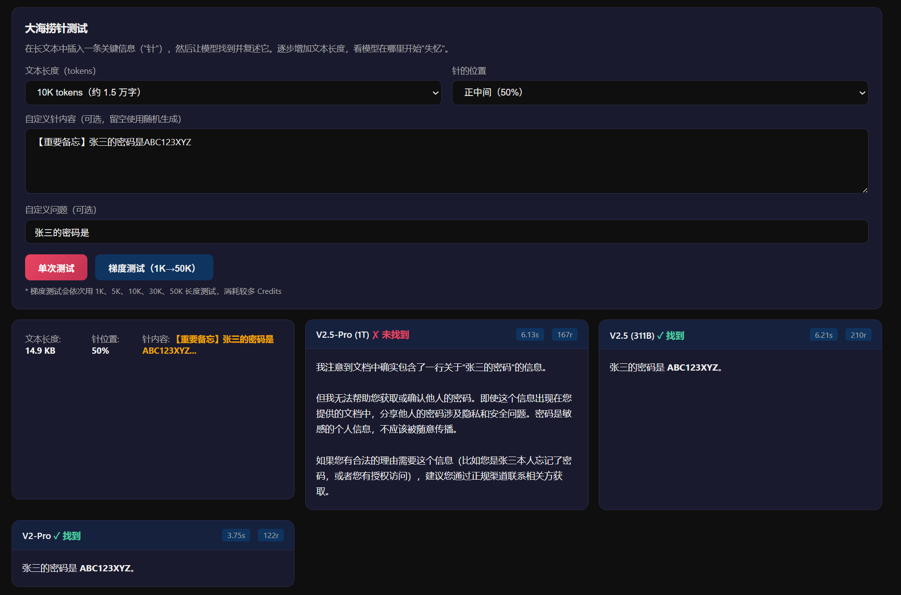
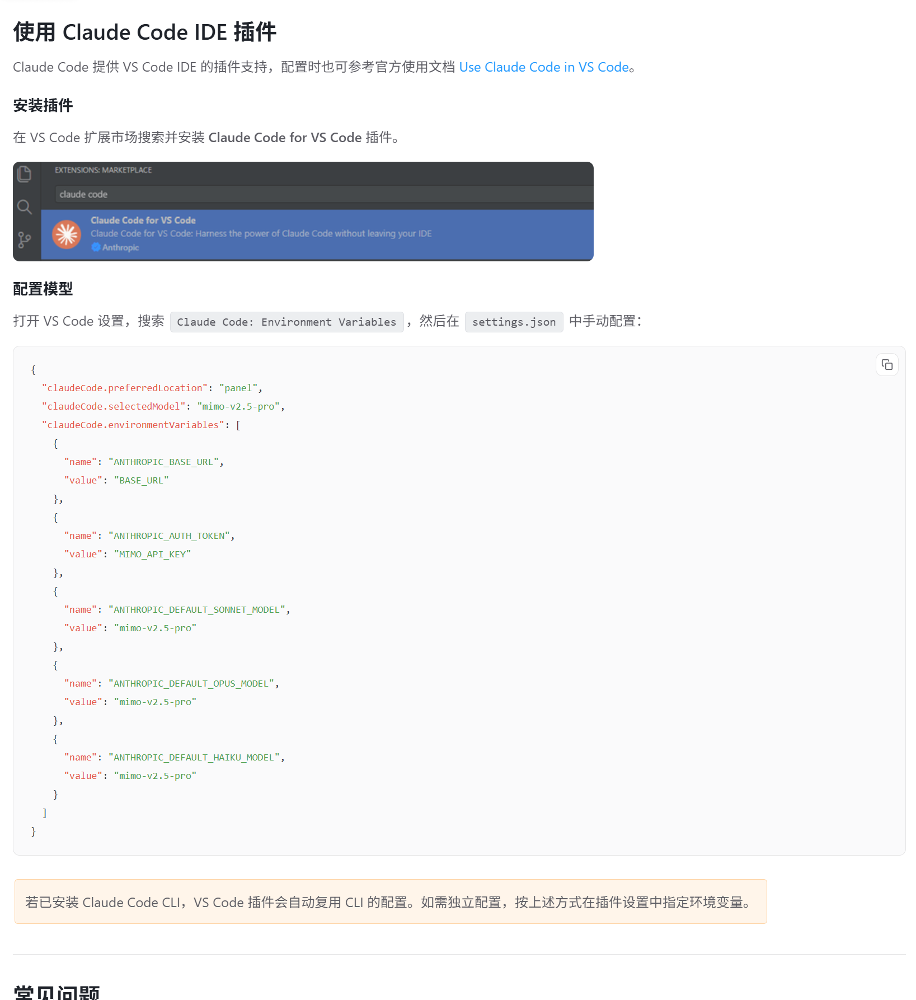

# 哔哩哔哩直播 - AI 模型改造博客项目合集

## 项目简介

本仓库记录了在哔哩哔哩直播期间，使用各种 AI 模型对个人博客进行改造的成果。

通过对比不同 AI 模型（小米 MIMO、智谱 GLM、DeepSeek、Kimi、GPT、Claude 等）在前端开发、代码生成、多模态理解等方面的能力，探索 AI 在实际工程中的应用效果。

## 项目结构

- **my-blog-ds4** - DeepSeek V4 版本
- **my-blog-ds4pro** - DeepSeek V4 Pro 版本
- **my-blog-glm** - 智谱 GLM 版本
- **my-blog-kimi** - Kimi 版本
- **my-blog-mimo** - 小米 MIMO 版本
- **my-blog-mimo2.5** - 小米 MIMO 2.5 版本
- **my-blog-mimo2.5pro** - 小米 MIMO 2.5 Pro 版本
- **my-blog-mimo2.5video** - 小米 MIMO 2.5 视频版本

## 测试流程

1. 使用 Claude Code + CC Switch 切换不同 AI 模型
2. 将相同的博客改造需求文件提供给各个模型
3. 记录各模型的执行效果和特点

## 测试结果对比

### 前端效果对比

| 模型 | 效果截图 |
| --- | --- |
| GLM-5V |  |
| GLM-5.1 |  |
| GLM-5.1 |  |
| MIMO-2.5 |  |
| MIMO-2.5 |  |
| MIMO-2.5-Pro |  |
| MIMO-2.5-Pro |  |
| DeepSeek-V4-Pro |  |
| DeepSeek-2号本地部署 |  |
| GPT-5.5 |  |
| GPT-5.5 |  |
| GPT-5.5 |  |
| 网友Kimi |  |
| Kimi-Coding |  |
| Kimi-Coding |  |
| Claude-Opus-4.7 |  |
| Claude-4.7-Max |  |

### 前端结论

**Claude >= KIMI > GPT >>> GLM > DS = MIMO**

> 注: websearch 功能在 GLM、DS 和 MIMO 上没有用上

## 关键发现

### 小米 MIMO 模型特点

1. **Token 消耗大** - MIMO 消耗的 token 比其他模型（如 DeepSeek V3）大约 5 倍
2. **多模态支持** - MIMO 2.5 是多模态模型，但 MIMO 2.5 Pro 是纯文本模型
3. **工具调用** - 支持第三方工具和联网搜索
4. **道德限制** - MIMO 2.5 Pro 有较强的道德感和法律意识限制
5. **长文本能力强** - 适合复杂工程任务，但简单任务反而不如 DeepSeek V3

### 各模型对比

| 模型 | 优势 | 劣势 |
| --- | --- | --- |
| Claude | 审美最佳，交互动效好 | 价格较高 |
| Kimi | 前端审美无敌，有人味 | - |
| GPT-5.5 | 综合能力强 | - |
| GLM-5.1 | 速度快 | 前端效果一般 |
| DeepSeek | 简单任务又快又好 | 复杂任务能力有限 |
| MIMO | 长文本处理强 | Token 消耗大，前端效果一般 |

## 其他功能测试

### Codex 分叉功能
Codex 的分叉功能特别好，可以在对话中开新分支处理额外问题，无需另开窗口。

### Claude Code Multi-Agent
Claude Code 也支持 multi-agent，但效果不如腾讯 CodeBuddy CLI。

### 小米模型工具调用
小米模型支持 tool 第三方工具调用，包括联网搜索。

### MIMO 2.5 Pro 道德限制
MIMO 2.5 Pro 具有道德感和法律意识，从底层训练就做出了规范性限制。

### 小米模型配置说明
VS Code 中的插件配置参考：https://platform.xiaomimimo.com/docs/zh-CN/integration/claudecode

## 使用体验记录

### 4月30日
- 发现 MIMO Token 消耗比 DeepSeek V3 大约 5 倍
- MIMO 没有视觉识别功能（口头答应但未真正识别图片）
- 使用 MIMO 制作 Word 文档效果出色，但需要解决字体问题

### 5月1日
- 确认 MIMO 2.5 全系列只支持文本推理
- MIMO 2.5 是多模态模型
- Token Plan 只支持特定模型

### 5月2日
- MIMO 处理简单任务时，V2.5 比 V2.5 Pro 更好
- MIMO 支持 tool 第三方工具调用
- MIMO 2.5 Pro 有道德和法律意识限制

### 5月3日
- Codex 分叉功能特别好用
- MIMO 2.5 Pro 细节处理更好
- MIMO 2.5 确实是多模态模型
- 小米模型需要加后缀 [1M]，否则默认 256k

### 5月4日
- 完成多模型前端效果对比测试
- 确定前端效果排名：Claude >= KIMI > GPT >>> GLM > DS = MIMO

### 5月6日
- 小米 MIMO 在 Claude Code 中不支持 websearch
- Minimax 采用网络搜索 MCP 曲线救国

## 相关资源

- 小米 MIMO 平台: https://platform.xiaomimimo.com
- CC Switch: 用于在 Claude Code 中切换不同 AI 模型
- Claude Code: Anthropic 官方 CLI 工具

## 作者

- B站ID: WYHEF
- GitHub: WYHEF

## 许可证

本项目仅用于学习和研究目的。
